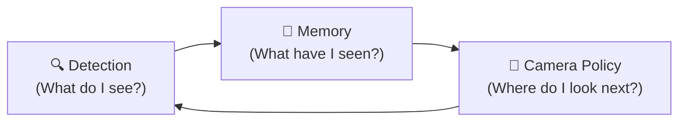
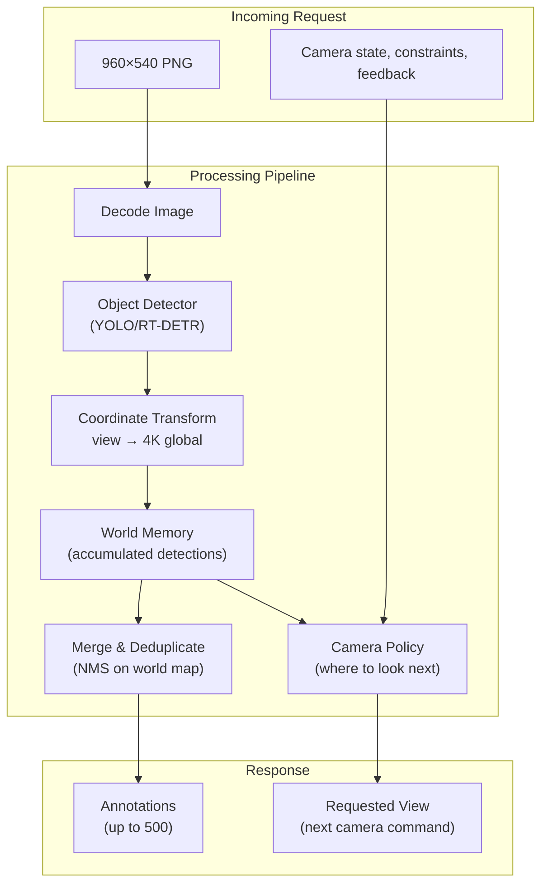

# Drone-Flyby Task — Deep Analysis & Architecture Strategy

## The Problem in a Nutshell

A simulated drone flies in a straight line at 600m altitude over a scene with military objects. You receive a **960×540 cropped view** of the underlying **3840×2160 (4K) frame**, and must return **detections for the ENTIRE 4K frame** + a **camera steering command**. You're scored on COCO mAP@0.50 across all frames — including objects you can't currently see.

> [!CAUTION]
> **Skipped and unanswered frames are scored as 0 detections** — every miss crushes recall. Latency is the silent killer.

---

## Core Mechanics

### Resolution Levels & The Fundamental Trade-Off

| Level | Source Region | Scale | Coverage | Detail |
|-------|-------------|-------|----------|--------|
| **0** | 3840×2160 | 4× downsample | 100% | See everything, but tiny objects are ~5-13 px |
| **1** | 1920×1080 | 2× downsample | 25% | Balanced — objects are 2× bigger |
| **2** | 960×540 | 1:1 native | 6.25% | Full detail, but see 1/16th of the frame |

### Object Sizes at Each Level (from Helsinki data)

```
                    4K Source     Level 0 (÷4)   Level 1 (÷2)   Level 2 (1:1)
                    ---------    -----------     -----------     -----------
condor              ~174 px      ~43 px          ~87 px          ~174 px       ← LARGE
hangar              ~186 px      ~46 px          ~93 px          ~186 px       ← LARGE
helicopter          ~117 px      ~29 px          ~58 px          ~117 px
large_launcher      ~146 px      ~36 px          ~73 px          ~146 px
jet_plane           ~81 px       ~20 px          ~40 px          ~81 px
small_tower         ~60 px       ~15 px          ~30 px          ~60 px
large_tower         ~66 px       ~16 px          ~33 px          ~66 px
tank                ~50 px       ~13 px          ~25 px          ~50 px
small_plane         ~50 px       ~13 px          ~25 px          ~50 px
spacecraft          ~49 px       ~12 px          ~25 px          ~49 px
medium_launcher     ~47 px       ~10 px          ~24 px          ~47 px
medium_plane        ~56 px       ~14 px          ~28 px          ~56 px
jammer              ~43 px       ~8-11 px        ~21 px          ~43 px
ta-ta               ~32 px       ~4-8 px         ~16 px          ~32 px        ← TINY
small_launcher      ~30 px       ~5-8 px         ~15 px          ~30 px        ← TINY
mine_roller         ~60 px       ~15 px          ~30 px          ~60 px
```

> [!IMPORTANT]
> At **Level 0**, the smallest objects (`ta-ta`, `small_launcher`, `jammer`) are only **4-11 pixels** — below the reliable detection threshold for most models. Level 1 bumps them to 15-21 px, which is marginal but workable with a good small-object detector.

### Camera Movement Constraints

- **Zoom transitions**: At most ±1 level per frame (no L0↔L2 jumps)
- **Max delta** (Euclidean, based on *current* level): L0 → 2203 px, L1 → 1102 px, L2 → 551 px
- **Special**: Returning to L0 center `(1920, 1080)` is always free (exempt from delta limit)
- **Invalid commands** are silently refused — camera stays put, but your detections still count

### Timing

- **3 fps** frame clock (333 ms between frames)
- **3333 ms** hard timeout per request
- Slow responses → frames skipped → scored as 0 detections
- Real-world target: **< 250-300 ms** per inference to avoid any frame drops

---

## Scoring Deep Dive

- **COCO mAP@0.50** — macro-averaged across the 16 classes
- **No server-side NMS** → duplicate predictions are devastating (each duplicate beyond the first matched GT is a false positive)
- **All GT objects in every frame** are evaluated, whether visible in your camera crop or not
- Skipped frames contribute 0 predictions → directly tanks recall

---

## Strategic Architecture Analysis

### The Three Pillars



### Pillar 1: Object Detection

**Model Choice** — This is an aerial/satellite-style small-object detection problem. Strong candidates:

| Model | Pros | Cons |
|-------|------|------|
| **YOLOv8/v11 (nano/small)** | Ultra-fast (~5-15 ms on GPU), battle-tested, great ONNX/TensorRT export | May struggle with smallest objects |
| **RT-DETR** | Strong on small objects, no NMS needed (built-in), end-to-end | Heavier, ~30-50 ms |
| **YOLOv8/v11 + SAHI (sliced inference)** | Handles tiny objects by tiling | Multiplies inference time by tile count |
| **YOLO-World / Grounding DINO** | Zero-shot with text prompts — no training data needed | Slower, may not be precise enough |

**Training Data Considerations**:
- We have only **25 frames** in `src/helsinki/` with 1 instance of each class — this is **reference data, not a training set**
- The validation run (249 frames) can be recorded and used for training/tuning
- The evaluation run (250 frames) is novel — must generalize
- **Few-shot / fine-tune strategy**: Use the 25 frames + validation recording to fine-tune a pre-trained YOLO/RT-DETR on these specific military object classes
- **Alternative**: Use a zero-shot model (YOLO-World, GroundingDINO) that doesn't need labeled training data

**Multi-resolution strategy**:
- At **Level 0**: Run detection for large objects (condor, hangar, helicopter, large_launcher) + coarse localization of object clusters
- At **Level 1/2**: Run detection for medium/small objects with higher confidence

### Pillar 2: Spatial Memory & Tracking

> [!TIP]
> **This is the key competitive advantage.** The task evaluates against the FULL 4K frame every frame. Objects detected in previous frames can be re-reported even when out of view — this dramatically boosts recall.

**Architecture**:
- Maintain a **world map** of detected objects in 4K source coordinates
- **Simple approach**: Store all high-confidence detections; re-emit them every frame (with decaying confidence)
- **Better approach**: Track object persistence — since the drone moves in a straight line at constant speed, object positions in the 4K frame shift predictably between frames (roughly constant vertical drift of ~14 m/step)
- **Best approach**: Build a scene model — stitch observations from multiple zoom levels into a comprehensive map, use temporal consistency to boost confidence and suppress false positives

**Coordinate tracking**: Objects move in the source frame as the drone advances. The `run_metadata.json` gives `step_m = 13.89`, meaning objects shift by a predictable pixel amount per frame. This can be estimated from consecutive L0 views or from the known altitude + step size.

### Pillar 3: Camera Policy (Active Vision)

The camera policy determines **what you look at and when**. This is a planning/exploration problem.

**Strategies** (from simple to sophisticated):

1. **Stay at L0**: Always see everything, detect what you can. Simple but misses small objects entirely.

2. **Scan pattern**: Systematic sweep — start at L0 to survey, zoom into L1/L2 to scan regions, zoom back out periodically. The horizontal sweep in `example.py` is a basic version of this.

3. **Attention-driven**: Use L0 detections to identify "interesting" regions, then zoom in on them with L1/L2 for better classification. This is an information-gain policy.

4. **Predictive planning**: Since the drone moves in a straight line, you can predict where objects will be in future frames and plan a camera path that covers them efficiently.

**Key insight**: With 25 frames at 3 fps, the entire run is only ~8 seconds. With 249-250 frames, it's ~83 seconds. The camera needs to efficiently explore while maintaining memory of what's been seen.

---

## Proposed Architecture



### Component Breakdown

| Component | Responsibility | Key Decisions |
|-----------|---------------|---------------|
| **Detector** | Run inference on 960×540 view | Model architecture, speed vs accuracy |
| **Coordinate Transform** | Convert view-local boxes to 4K global | Already provided in `utils.py` |
| **World Memory** | Accumulate detections across frames | Data structure, confidence decay, deduplication |
| **Merger / NMS** | Produce final annotation list per frame | IoU threshold, cross-frame matching |
| **Camera Policy** | Choose next `(level, cx, cy)` | Exploration vs exploitation, planning horizon |

---

## Latency Budget (Target: < 300 ms total)

```
Image decode (base64 → numpy)     ~5-10 ms
Model inference (YOLO-nano GPU)    ~8-15 ms
Model inference (YOLO-small GPU)   ~15-30 ms
Model inference (RT-DETR)          ~30-60 ms
Post-processing + NMS              ~2-5 ms
Memory update + merge              ~1-3 ms
Camera policy                      ~1 ms
Response serialization             ~2-5 ms
─────────────────────────────────────────
Total (YOLO-nano path)             ~20-40 ms  ✅ Very comfortable
Total (YOLO-small path)            ~30-55 ms  ✅ Comfortable
Total (RT-DETR path)               ~45-85 ms  ✅ OK
```

> [!NOTE]
> Even with generous margins, we're well under the 333 ms frame interval. This leaves room for SAHI-style tiled inference if needed (2-4 tiles at L0 for small object detection).

---

## Recommended Approach — Phased Plan

### Phase 1: Foundation (Get a working pipeline)
- Set up YOLO (v8 or v11, nano/small) with pre-trained COCO weights
- Map the 16 task classes to closest COCO classes OR use a zero-shot model
- Implement the full pipeline: decode → detect → transform → respond
- Test with `local_evaluator.py`, measure baseline mAP and latency

### Phase 2: Memory System
- Implement world-map accumulation of detections
- Add cross-frame NMS (suppress duplicates across time)
- Re-emit tracked objects every frame → big recall boost

### Phase 3: Camera Policy
- Implement attention-driven zoom: survey at L0, zoom into regions of interest at L1/L2
- Handle zoom transitions smoothly (L0→L1→L2→L1→L0)

### Phase 4: Fine-tuning
- Record the validation run frames (249 frames)
- Fine-tune the detector on task-specific classes using Helsinki + validation data
- Tune confidence thresholds per class

### Phase 5: Optimization
- Export model to ONNX/TensorRT for speed
- Consider SAHI tiling at L0 for small objects
- Tune the camera policy with learned heuristics

---

## Open Questions

1. **GPU availability**: Do we have a CUDA GPU available in the deployment environment? This dramatically affects model choice.
2. **Zero-shot vs fine-tuned**: Should we start with a zero-shot approach (YOLO-World / GroundingDINO) to avoid the limited training data problem, or fine-tune YOLO on the 25 reference frames?
3. **Competition timeline**: How much time do we have? This affects how many phases we can implement.
4. **Validation recording**: Have you already run the validation endpoint, or is that something we should do early to collect training data?
