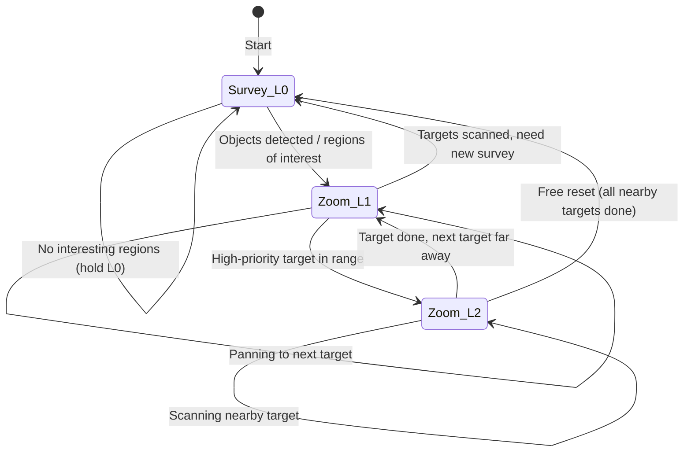
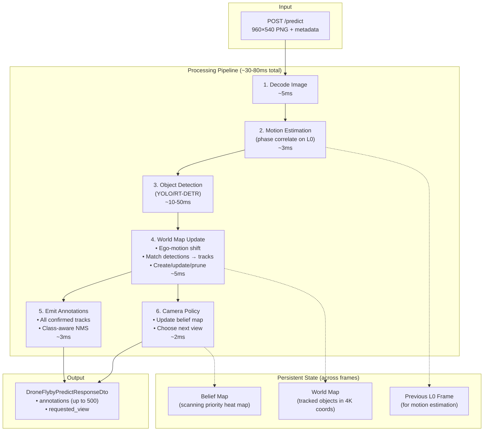

# Drone-Flyby — Deep Dive: Memory System & Camera Policy

## Part 1: Memory & Tracking System

### Why This Matters

The scoring evaluates detections against **all** ground-truth objects in the **full 4K frame** every frame. Objects you've seen before but are now out of view should still be reported. A good memory system is the single biggest recall booster — it's essentially free mAP.

### Tracking Algorithm Selection

| Algorithm | CMC | Appearance | Speed | Fit for This Problem |
|-----------|-----|-----------|-------|---------------------|
| **SORT** | ❌ | ❌ | ⚡ Fast | Poor — no camera motion compensation, will lose tracks when camera pans |
| **DeepSORT** | ❌ | ✅ Re-ID | Medium | Overkill — appearance features unnecessary for static objects |
| **ByteTrack** | ❌ | ❌ | ⚡ Fast | Decent — uses low-confidence detections, but no CMC |
| **BoT-SORT** | ✅ | ✅ | Medium | Good — has CMC built-in via feature tracking |
| **Norfair** | ✅ | Flexible | ⚡ Fast | **Best fit** — native `MotionEstimator`, fully customizable distance function, lightweight |

> [!TIP]
> **Recommendation: Norfair** — It's a lightweight Python library that natively supports camera motion estimation, allows custom distance functions (IoU in 4K space), and gives full control over track initialization/termination. Install with `pip install norfair`.

### Motion Model for Static Ground Objects

Since objects are static and the drone flies in a straight line at constant speed, apparent object motion in the frame is **pure translation**, approximately constant between frames.

#### Geometric Estimate

The drone is at 600m altitude with a step of 13.89 m/frame. Assuming the 4K frame covers the ground footprint:

$$\text{pixels per frame} \approx \frac{13.89}{H_{\text{ground}}} \times 2160$$

where $H_{\text{ground}}$ is the vertical ground coverage. From the annotation data (objects drifting ~55-60 px vertically per frame between frames 0→5), we can estimate:

$$\Delta y \approx 55\text{–}60 \text{ px/frame (downward in image)}$$
$$\Delta x \approx 0 \text{ px/frame (straight-line flight)}$$

#### Empirical Estimation (More Robust)

Use OpenCV `cv2.phaseCorrelate` on consecutive L0 frames (grayscale) to compute the exact sub-pixel translation:

```python
def estimate_frame_shift(prev_gray, curr_gray):
    """Estimate (dx, dy) pixel shift between consecutive L0 frames."""
    # Phase correlation — fast, sub-pixel accurate, translation-only
    shift, confidence = cv2.phaseCorrelate(
        np.float32(prev_gray), np.float32(curr_gray)
    )
    return shift  # (dx, dy) in L0 pixels → multiply by 4 for 4K coords
```

> [!NOTE]
> Phase correlation works best on L0 frames (full scene, rich texture). At L2, the small field of view may lack enough structure for reliable correlation. Always keep the last L0 frame for motion estimation.

### World Map Architecture

```python
from dataclasses import dataclass, field
from typing import Optional
import numpy as np

@dataclass
class TrackedObject:
    track_id: int
    class_id: str                     # Best class label so far
    bbox_4k: tuple[float, float, float, float]  # (x1, y1, x2, y2) in 4K pixels
    confidence: float                 # Best confidence observed
    best_zoom: int                    # Zoom level of best observation
    
    # Lifecycle
    hits: int = 0                     # Frames where this was detected in-view
    age: int = 0                      # Total frames since first detection
    frames_since_seen: int = 0        # Frames since last in-view detection
    
    # For re-emission
    last_bbox_global: tuple[float, float, float, float] = (0,0,0,0)  # normalized [0,1]


class WorldMap:
    def __init__(self):
        self.tracks: dict[int, TrackedObject] = {}
        self.next_id = 0
        self.frame_shift = (0.0, 0.0)  # (dx, dy) per frame in 4K pixels
    
    def update_motion(self, dx_4k: float, dy_4k: float):
        """Apply ego-motion compensation: shift all tracked objects."""
        self.frame_shift = (dx_4k, dy_4k)
        for t in self.tracks.values():
            x1, y1, x2, y2 = t.bbox_4k
            t.bbox_4k = (x1 + dx_4k, y1 + dy_4k, x2 + dx_4k, y2 + dy_4k)
    
    def update_detections(self, detections, source_region_xyxy, current_zoom):
        """Match new detections against existing tracks, update or create."""
        # Convert all detections to 4K coordinates
        det_boxes_4k = [view_bbox_to_source(d.bbox, source_region_xyxy) for d in detections]
        
        # Hungarian matching using IoU in 4K space
        matched, unmatched_dets, unmatched_tracks = hungarian_iou_match(
            det_boxes_4k, 
            [t.bbox_4k for t in self._in_view_tracks(source_region_xyxy)],
            iou_threshold=0.3
        )
        
        # Update matched tracks
        for det_idx, track_id in matched:
            track = self.tracks[track_id]
            det = detections[det_idx]
            
            # Prefer higher-zoom observations (more precise)
            if current_zoom >= track.best_zoom:
                track.bbox_4k = det_boxes_4k[det_idx]
                track.class_id = det.class_id
                track.confidence = max(track.confidence, det.confidence)
                track.best_zoom = current_zoom
            
            track.hits += 1
            track.frames_since_seen = 0
        
        # Create new tracks for unmatched detections
        for det_idx in unmatched_dets:
            det = detections[det_idx]
            self.tracks[self.next_id] = TrackedObject(
                track_id=self.next_id,
                class_id=det.class_id,
                bbox_4k=det_boxes_4k[det_idx],
                confidence=det.confidence,
                best_zoom=current_zoom,
                hits=1
            )
            self.next_id += 1
        
        # Handle unmatched in-view tracks (expected detection but none found)
        for track_id in unmatched_tracks:
            track = self.tracks[track_id]
            track.frames_since_seen += 1
    
    def age_all(self):
        """Age all tracks and prune dead ones."""
        dead = []
        for tid, t in self.tracks.items():
            t.age += 1
            # Remove if: too few hits relative to age (likely false positive)
            # OR object has drifted out of the 4K frame bounds
            if t.hits < 2 and t.age > 5:
                dead.append(tid)
            elif not self._in_frame(t.bbox_4k):
                dead.append(tid)
        for tid in dead:
            del self.tracks[tid]
    
    def get_annotations(self) -> list:
        """Emit ALL tracked objects as annotations (including out-of-view)."""
        annotations = []
        for t in self.tracks.values():
            if t.hits < 2:  # Require at least 2 hits to confirm
                continue
            bbox_global = source_bbox_to_global(t.bbox_4k, 3840, 2160)
            bbox_clipped = clip_bbox_to_frame(bbox_global)
            if bbox_clipped is None:
                continue
            
            # Confidence: full for recently seen, slight decay for out-of-view
            conf = t.confidence * (0.95 ** t.frames_since_seen)
            annotations.append({
                'object_id': t.class_id,
                'bbox': bbox_clipped,
                'confidence': max(conf, 0.05)
            })
        
        # Global NMS to prevent duplicates (critical — no server-side NMS!)
        annotations = class_aware_nms(annotations, iou_threshold=0.45)
        return annotations[:500]  # Max 500 per response
```

### Confidence Management Strategy

| Situation | Action |
|-----------|--------|
| Object **in-view** and **detected** | Update bbox, bump confidence, reset `frames_since_seen` |
| Object **in-view** but **not detected** | Increment `frames_since_seen`, keep emitting (might be occluded) |
| Object **out-of-view** | **Do NOT decay aggressively** — keep emitting at high confidence since it's static and we simply can't see it |
| Object **drifted out of 4K frame** | Remove from world map (it's gone) |
| Object with **few hits, many frames** | Remove — likely false positive |

> [!IMPORTANT]
> The key insight: for **out-of-view** objects, confidence should decay very slowly (or not at all) because the objects are *static*. They haven't moved or changed — we just can't see them. Aggressive decay would throw away easy recall.

### Cross-Resolution Matching

Objects detected at L0 (~15px, blurry) and L2 (~60px, sharp) must be matched in the same 4K coordinate space.

**Strategy**: Always project detections to 4K source coordinates using `view_bbox_to_source()` before matching. In 4K space, the same physical object has the same coordinates regardless of zoom level, so IoU matching works naturally.

**Refinement rule**: When a track is updated from a higher zoom level, overwrite its bbox and class label — the higher-res observation is strictly more accurate.

### Global Deduplication

Since there's **no server-side NMS**, duplicate predictions are catastrophic (each extra box for the same GT object is a false positive).

```python
def class_aware_nms(annotations, iou_threshold=0.45):
    """NMS grouped by class to prevent duplicate predictions."""
    from collections import defaultdict
    by_class = defaultdict(list)
    for ann in annotations:
        by_class[ann['object_id']].append(ann)
    
    result = []
    for cls, anns in by_class.items():
        # Sort by confidence descending
        anns.sort(key=lambda a: a['confidence'], reverse=True)
        keep = []
        for ann in anns:
            if not any(iou(ann['bbox'], k['bbox']) > iou_threshold for k in keep):
                keep.append(ann)
        result.extend(keep)
    return result
```

---

## Part 2: Camera Policy

### Coverage Mathematics

#### Level 1: 4 Tiles, ~5 Frames

The 4K frame divides into **4 non-overlapping L1 tiles** (each 1920×1080):

```
┌──────────┬──────────┐
│  (960,   │  (2880,  │
│   540)   │   540)   │   Row 1
├──────────┼──────────┤
│  (960,   │  (2880,  │
│  1620)   │  1620)   │   Row 2
└──────────┴──────────┘
```

- Vertical step (1080 px) ≤ L1 max delta (1102 px) → **1 frame**
- Horizontal step (1920 px) > L1 max delta (1102 px) → **2 frames**
- **Optimal boustrophedon scan: 5 frames** (TL → BL → *transition* → BR → TR)

#### Level 2: 16 Tiles, ~19-22 Frames

The 4K frame divides into **16 non-overlapping L2 tiles** (each 960×540):

```
┌────┬────┬────┬────┐
│ 480│1440│2400│3360│  y=270
├────┼────┼────┼────┤
│    │    │    │    │  y=810
├────┼────┼────┼────┤
│    │    │    │    │  y=1350
├────┼────┼────┼────┤
│    │    │    │    │  y=1890
└────┴────┴────┴────┘
```

- Vertical step (540 px) ≤ L2 max delta (551 px) → **1 frame**
- Horizontal step (960 px) > L2 max delta (551 px) → **2 frames**
- **Snake scan of 1 column (4 tiles): 4 frames**
- **Column-to-column transition: 2 frames**
- **Full raster: 4 + 2 + 4 + 2 + 4 + 2 + 4 = 22 frames** (conservative)
- **Practical: ~19 frames** (useful data captured during transitions)

> [!WARNING]
> A full L2 raster takes **19-22 frames (~6-7 seconds)**. During this time, the drone moves ~270m and objects shift ~1100 px vertically. Objects near the bottom of the frame may exit before you scan them. **A blind raster scan is insufficient — you need prioritization.**

#### Level 0: Instant Full Coverage (But Low Quality)

- L0 always covers 100% of the frame
- Free reset to L0 center `(1920, 1080)` at any time
- Perfect for periodic "survey" frames

### Camera Policy Strategies Compared

| Strategy | Pros | Cons | mAP Impact |
|----------|------|------|------------|
| **Stay at L0** | See everything, simple | Can't detect small objects (4-8px) | Low — misses ~40% of classes |
| **Full L2 raster** | Maximum detail | 22 frames/cycle, misses moving-out objects | Medium — good precision, poor temporal coverage |
| **L1 scan** | Good balance, 5 frames/cycle | Some objects still small (~15px) | Medium-high |
| **Hybrid L0 survey + L2 zoom** | Adaptable, finds everything | Complex to implement | **Highest** |
| **Attention-driven** | Focuses resources where objects are | Misses objects in un-surveyed areas | High (if L0 survey is frequent) |

### Recommended Strategy: Hybrid L0-Survey + Attention-Driven Zoom



**Core loop**:
1. **Survey at L0** every N frames to get a global picture (even if detections are poor, saliency/blob detection can flag regions of interest)
2. **Prioritize regions** — rank unscanned or high-density regions
3. **Zoom in** (L0 → L1 → L2) toward the highest-priority region
4. **Scan the local area** at L2, detecting and confirming objects with high accuracy
5. **Free-reset to L0** when done with the current area, then repeat

### Belief Map / Heat Map Implementation

```python
class CameraPolicy:
    def __init__(self):
        # Probability that unscanned regions contain objects
        # Initialize uniformly — we know nothing yet
        self.belief = np.ones((2160, 3840), dtype=np.float32) * 0.5
        
        # Time since each region was last observed at high resolution
        self.staleness = np.zeros((2160, 3840), dtype=np.float32)
        
        # Priority = belief * staleness (prefer uncertain + stale regions)
        self.target_queue: list[tuple[int, int, int]] = []  # (cx, cy, level)
    
    def update(self, source_region_xyxy, zoom_level, detections):
        """Update belief after observing a region."""
        sx1, sy1, sx2, sy2 = source_region_xyxy
        
        # Mark observed region as scanned
        if zoom_level >= 1:
            # High-res observation → high certainty
            self.belief[sy1:sy2, sx1:sx2] *= 0.1  # Suppress uncertainty
            self.staleness[sy1:sy2, sx1:sx2] = 0   # Just observed
        
        # Increase staleness everywhere else
        self.staleness += 1
        self.staleness[sy1:sy2, sx1:sx2] = 0
        
        # Boost belief where L0 detected blobs/saliency
        for det in detections:
            x1, y1, x2, y2 = det.bbox_4k
            self.belief[int(y1):int(y2), int(x1):int(x2)] = 1.0
    
    def shift_for_egomotion(self, dx, dy):
        """Shift maps to compensate for drone movement."""
        M = np.float32([[1, 0, dx], [0, 1, dy]])
        self.belief = cv2.warpAffine(self.belief, M, (3840, 2160))
        self.staleness = cv2.warpAffine(self.staleness, M, (3840, 2160))
    
    def choose_next_view(self, current_level, current_center, camera_constraints):
        """Select the next camera command based on belief and staleness."""
        
        # Score = belief * log(1 + staleness) — prefer uncertain, stale regions
        priority = self.belief * np.log1p(self.staleness)
        
        # Strategy decision: survey or zoom?
        max_priority = priority.max()
        mean_priority = priority.mean()
        
        # If we haven't surveyed recently, reset to L0
        if self.staleness.mean() > 15 or current_level == 0:
            # We're at L0 or need a survey — plan next zoom target
            target = self._find_best_l2_target(priority)
            if current_level == 0:
                return self._step_toward_target(target, current_center,
                                                 current_level, camera_constraints)
        
        # If at L2 and nearby targets exist, pan to them
        if current_level == 2:
            nearby = self._find_best_l2_target(priority, 
                                                max_dist=camera_constraints.maximum_center_delta)
            if nearby:
                return RequestedViewDto(
                    resolution_level=2,
                    center_x=int(nearby[0]),
                    center_y=int(nearby[1])
                )
            else:
                # No nearby targets — free reset to L0
                return RequestedViewDto(
                    resolution_level=0,
                    center_x=1920, center_y=1080
                )
        
        # Default: step toward best target
        target = self._find_best_l2_target(priority)
        return self._step_toward_target(target, current_center,
                                         current_level, camera_constraints)
    
    def _find_best_l2_target(self, priority, max_dist=None):
        """Find the L2-sized region with highest priority score."""
        best_score = -1
        best_center = (1920, 1080)
        
        # Slide a 960x540 window across the priority map
        for cy in range(270, 1891, 270):   # Step by half-height for overlap
            for cx in range(480, 3361, 480):
                region = priority[cy-270:cy+270, cx-480:cx+480]
                score = region.sum()
                if score > best_score:
                    best_score = score
                    best_center = (cx, cy)
        
        return best_center
    
    def _step_toward_target(self, target, current_center, current_level, constraints):
        """Move one step toward target, respecting constraints."""
        tx, ty = target
        cx, cy = current_center
        max_delta = constraints.maximum_center_delta
        
        dx, dy = tx - cx, ty - cy
        dist = (dx**2 + dy**2) ** 0.5
        
        if dist <= max_delta:
            # Can reach in one step — also zoom in if possible
            new_level = min(current_level + 1, 2)
            return RequestedViewDto(
                resolution_level=new_level,
                center_x=int(tx), center_y=int(ty)
            )
        else:
            # Move as far as we can toward target
            scale = max_delta / dist * 0.95  # 5% safety margin
            new_cx = int(cx + dx * scale)
            new_cy = int(cy + dy * scale)
            # Zoom in while traveling if possible
            new_level = min(current_level + 1, 2)
            return RequestedViewDto(
                resolution_level=new_level,
                center_x=new_cx, center_y=new_cy
            )
```

### Tactical Considerations

**The Free L0 Reset is a Superpower**

Returning to L0 `(1920, 1080)` is exempt from distance limits. This enables a powerful pattern:

```
L2 scan area A → Free reset to L0 → Survey → L1 → L2 scan area B
     (3 frames to go from any L2 position to any other L2 position via L0)
```

Without the free reset, crossing the frame at L2 could take 8+ frames. With it, you can teleport in 3 frames (L2→L1→L0→L1) or 4 frames (L2→L1→L0→L1→L2).

**Periodic L0 Surveys**

Even though L0 can't reliably detect small objects, it serves two critical purposes:
1. **Motion estimation** — phase correlation between L0 frames gives the ego-motion vector
2. **Coarse saliency** — large objects (condor, hangar, helicopter, large_launcher) ARE detectable at L0, and blob/edge density can flag regions with potential small objects

**Recommended survey cadence**: Return to L0 every **8-12 frames** (every ~3-4 seconds). This gives 6-10 frames of L1/L2 scanning between surveys.

---

## Combined Architecture



### Libraries to Install

| Library | Purpose | Install |
|---------|---------|---------|
| **norfair** | Multi-object tracking with camera motion compensation | `pip install norfair` |
| **ultralytics** | YOLO v8/v11 detection models | `pip install ultralytics` |
| **supervision** | Annotation rendering, NMS utilities, dataset tools | `pip install supervision` |
| **torch + torchvision** | Model backend | `pip install torch torchvision` |
