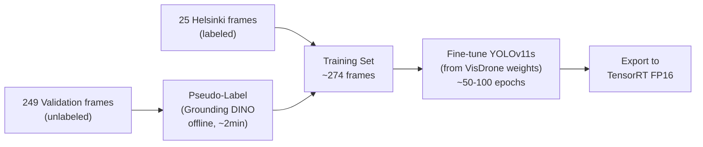
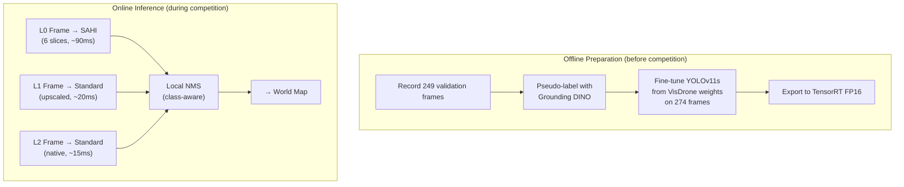

# Drone-Flyby — Deep Dive: Object Detection

## The Detection Challenge

This is an **aerial small-object detection** problem with extreme scale variation:

| Zoom Level       | Smallest Objects | Largest Objects | Detection Difficulty                         |
| ---------------- | ---------------- | --------------- | -------------------------------------------- |
| **L0** (4× down) | 4-8 px           | ~45 px          | Extreme — below most model thresholds        |
| **L1** (2× down) | 10-15 px         | ~90 px          | Hard — marginal for standard detectors       |
| **L2** (native)  | 20-30 px         | ~180 px         | Standard — well within YOLO receptive fields |

Additional constraints:

- **333 ms** per-frame budget (3 fps), hard timeout at 3333 ms
- **No server-side NMS** — duplicates destroy precision
- Only **25 labeled frames** for training (can record 249 more from validation)
- Must generalize to a novel 250-frame evaluation sequence

---

## 1. Model Architecture Comparison

### YOLO Family (Recommended Primary)

| Model        | Params | FLOPs | Inference (TensorRT FP16) | COCO mAP@50 | Fit                                 |
| ------------ | ------ | ----- | ------------------------- | ----------- | ----------------------------------- |
| **YOLOv11n** | 2.6M   | 6.5G  | ~3-5 ms                   | 39.5        | ⚡ Ultra-fast, good for L2          |
| **YOLOv11s** | 9.4M   | 21.5G | ~8-15 ms                  | 47.0        | ✅ **Best speed/accuracy tradeoff** |
| **YOLOv11m** | 20.1M  | 68.0G | ~20-35 ms                 | 51.5        | Good accuracy, still fast enough    |
| **YOLOv8s**  | 11.2M  | 28.6G | ~10-18 ms                 | 44.9        | Proven, slightly behind v11         |
| **YOLOv8m**  | 25.9M  | 78.9G | ~25-40 ms                 | 50.2        | Heavier, solid accuracy             |

### RT-DETR (Transformer-Based)

| Model         | Inference | mAP@50 | Notes                                                 |
| ------------- | --------- | ------ | ----------------------------------------------------- |
| **RT-DETR-L** | ~30-50 ms | 53.0   | No NMS needed (built-in), excellent for small objects |
| **RT-DETR-X** | ~50-80 ms | 54.8   | Heavier but better precision                          |

**Pros**: Transformer attention naturally handles multi-scale detection. Built-in set prediction eliminates NMS — important since no server-side NMS.
**Cons**: 2-4× slower than equivalent YOLO. May be tight on budget with SAHI.

### Zero-Shot Models (Offline Use Only)

| Model              | Inference   | Use Case                                                                   |
| ------------------ | ----------- | -------------------------------------------------------------------------- |
| **Grounding DINO** | ~200-500 ms | Pseudo-labeling offline — too slow for real-time                           |
| **Florence-2**     | ~150-400 ms | Pseudo-labeling offline                                                    |
| **YOLO-World**     | ~20-50 ms   | Possible real-time zero-shot, but precision questionable for 4-8px objects |
| **OWLv2**          | ~100-300 ms | Offline labeling                                                           |

> [!IMPORTANT]
> **Primary recommendation: YOLOv11s** — best speed/accuracy balance. With TensorRT FP16, it runs in ~10ms at 960×540, leaving massive headroom for SAHI tiling, memory updates, and camera policy. Fine-tune from aerial/drone pretrained weights.

---

## 2. The P2 Detection Head — Critical for Small Objects

Standard YOLO uses 3 detection heads at strides 8, 16, 32 (called P3, P4, P5). The P3 head (stride 8) produces a 120×67 feature grid for 960×540 input — each grid cell covers 8×8 pixels. Objects smaller than ~16 px struggle to activate features at this resolution.

**The P2 head** adds a 4th detection layer at stride 4, producing a 240×135 grid. Each cell covers just 4×4 pixels, directly addressing the 4-8 px object problem at L0.

```yaml
# YOLOv11s with P2 head — ultralytics config snippet
head:
    - [-1, 1, nn.Upsample, [None, 2, "nearest"]] # Upsample to P2
    - [[-1, 2], 1, Concat, [1]] # Concat with backbone P2 features
    - [-1, 3, C2f, [64]] # P2 detection layer (stride 4)
    # ... standard P3, P4, P5 heads follow
```

> [!NOTE]
> Adding a P2 head increases FLOPs by ~30-50% and inference time accordingly (~15-22ms instead of ~10-15ms). This is still well within budget. The mAP improvement on small objects is typically **+5-15 points**.

---

## 3. SAHI — Sliced Aided Hyper Inference

SAHI slices the input image into overlapping crops, runs detection on each, then merges results with NMS.

### How It Works

```
Input: 960×540 image
                    ┌───────────┬───────────┐
Slice into          │  Slice 1  │  Slice 2  │
overlapping tiles   │  512×512  │  512×512  │
(e.g. 512×512       ├───────────┼───────────┤
with 20% overlap)   │  Slice 3  │  Slice 4  │
                    │  512×512  │  512×512  │
                    └───────────┴───────────┘
                              ↓
Run detector on each slice (4× inference)
                              ↓
Merge predictions + NMS across slices
```

### When to Use SAHI

| Level  | SAHI?               | Reason                                                       |
| ------ | ------------------- | ------------------------------------------------------------ |
| **L0** | ✅ Yes (4-6 slices) | Objects are 4-45px — need magnification. ~60-90ms total.     |
| **L1** | ⚠️ Maybe (2 slices) | Objects are 10-90px — marginal improvement. ~20-30ms.        |
| **L2** | ❌ No               | Objects are 20-180px — standard inference is fine. ~10-15ms. |

### Speed Budget with SAHI

```
L0 + SAHI (6 slices × 15ms each):   ~90ms  ← Still within 333ms budget ✅
L0 + SAHI (4 slices × 15ms each):   ~60ms  ← Comfortable ✅
L1 standard:                         ~15ms  ← Very fast ✅
L2 standard:                         ~15ms  ← Very fast ✅
```

### SAHI Implementation

```python
from sahi import AutoDetectionModel, get_sliced_prediction

detection_model = AutoDetectionModel.from_pretrained(
    model_type="yolov8",
    model_path="best.pt",
    confidence_threshold=0.15,
    device="cuda:0"
)

def detect_with_sahi(image, zoom_level):
    if zoom_level == 0:
        # SAHI for L0 — catch tiny objects
        result = get_sliced_prediction(
            image,
            detection_model,
            slice_height=480,
            slice_width=480,
            overlap_height_ratio=0.2,
            overlap_width_ratio=0.2,
            postprocess_type="NMS",           # Merge overlapping slices
            postprocess_match_threshold=0.5,
        )
    else:
        # Standard inference for L1/L2
        result = get_sliced_prediction(
            image,
            detection_model,
            slice_height=540,    # Full image = 1 slice
            slice_width=960,
            overlap_height_ratio=0.0,
            overlap_width_ratio=0.0,
        )
    return result.object_prediction_list
```

> [!WARNING]
> SAHI's internal NMS merges detections across slices, but you **still need your own global NMS** before submitting — especially to deduplicate against the world map's re-emitted historical detections.

---

## 4. Pre-Trained Weights — Domain-Specific Starting Points

Starting from **COCO** weights is suboptimal — COCO has no aerial/overhead perspective, no military vehicles, and different object size distributions.

### Best Pre-Training Datasets

| Dataset           | Domain               | Classes                               | Images      | Relevance                                     |
| ----------------- | -------------------- | ------------------------------------- | ----------- | --------------------------------------------- |
| **VisDrone**      | Drone aerial imagery | 10 (pedestrian, car, truck, etc.)     | 10K+        | ⭐⭐⭐ Best perspective match                 |
| **DOTA / DOTAv2** | Satellite/aerial     | 15-18 (plane, helicopter, ship, etc.) | 12K+        | ⭐⭐⭐ Has aircraft & military objects        |
| **xView**         | Satellite            | 60 (including military vehicles)      | 1M+ objects | ⭐⭐ Military classes, but satellite altitude |
| **COCO**          | Ground-level         | 80 general classes                    | 330K        | ⭐ Wrong perspective, but robust features     |

### Where to Find Pre-Trained Aerial Models

```python
# Option 1: Ultralytics Hub — search for VisDrone/DOTA models
from ultralytics import YOLO
model = YOLO("yolo11s.pt")  # Start from COCO, fine-tune on our data

# Option 2: HuggingFace — look for aerial-specific checkpoints
# e.g., "dronefreak/visdrone-yolov11s" or similar

# Option 3: Fine-tune from DOTA weights if available
# DOTA has plane, helicopter, ship classes — closest domain match
```

> [!TIP]
> **Best strategy**: Start from VisDrone or DOTA pre-trained weights (matching the aerial perspective), then fine-tune on our 25 Helsinki frames + pseudo-labeled validation data. This gives the model the right inductive bias for overhead small objects.

---

## 5. Few-Shot Training Strategy

### The Data Problem

- **25 labeled frames** in `src/helsinki/` — only 1 instance of each class across the sequence
- **249 validation frames** — can be recorded but arrive unlabeled
- **250 evaluation frames** — novel, unseen
- Total: ~260 annotations across 25 frames (avg 10.4/frame)

This is extremely limited for supervised training. A staged approach is needed.

### Recommended Pipeline



### Step 1: Record Validation Data

Run the validation endpoint and save every frame:

```python
# In your predict() handler, save incoming frames
def predict(request):
    image = decode_view(request.view)
    # Save for training later
    cv2.imwrite(f"training_data/val_{request.frame_index:04d}.png", image)
    # ... normal detection logic
```

### Step 2: Offline Pseudo-Labeling with Grounding DINO

```python
from groundingdino.util.inference import load_model, predict

model = load_model("groundingdino_swinb_cogvit.pth")

# Use text prompts matching our 16 classes
TEXT_PROMPT = ("hangar . helicopter . jet plane . large launcher . "
               "large tower . medium launcher . medium plane . "
               "mine roller . small launcher . small plane . "
               "small tower . ta-ta . tank . condor . jammer . spacecraft")

for frame_path in validation_frames:
    image = cv2.imread(frame_path)
    boxes, logits, phrases = predict(model, image, TEXT_PROMPT)
    save_yolo_format(frame_path, boxes, phrases)  # Save as YOLO labels
```

### Step 3: Augmentation Strategy

```yaml
# ultralytics training config
augmentation:
    mosaic: 1.0 # Mosaic — critical for small objects
    mixup: 0.15 # MixUp — helps generalization
    copy_paste: 0.3 # Copy-paste small objects onto different backgrounds
    scale: 0.5 # Random scaling — simulates different zoom levels
    flipud: 0.5 # Vertical flip
    fliplr: 0.5 # Horizontal flip
    hsv_h: 0.015 # Slight color jitter
    hsv_s: 0.4
    hsv_v: 0.4
    degrees: 180 # Full rotation — aerial view is rotation-invariant
    translate: 0.2

    # AVOID these for aerial:
    perspective: 0.0 # Don't warp perspective — view is already top-down
    shear: 0.0 # Don't shear
```

### Step 4: Multi-Scale Training

Train with images at multiple scales to handle L0/L1/L2 variation:

```python
from ultralytics import YOLO

model = YOLO("yolo11s.pt")  # or VisDrone pretrained

model.train(
    data="drone_flyby.yaml",
    epochs=100,
    imgsz=960,              # Match inference resolution
    batch=8,
    lr0=0.001,              # Lower LR for fine-tuning (not training from scratch)
    lrf=0.01,
    warmup_epochs=5,
    multi_scale=True,       # Random resize during training (±50%)
    patience=20,            # Early stopping
    augment=True,
    close_mosaic=10,        # Disable mosaic for last 10 epochs (stabilize)
)
```

---

## 6. Multi-Resolution Inference Strategy

Different zoom levels need different detection approaches:

```python
class MultiResDetector:
    def __init__(self, model_path):
        self.model = YOLO(model_path)

    def detect(self, image, zoom_level, source_region_xyxy):
        """Adaptive detection based on zoom level."""

        if zoom_level == 0:
            # L0: SAHI tiling for tiny objects + full-image for large objects
            detections = self._detect_sahi(image,
                                           slice_size=480,
                                           overlap=0.2,
                                           conf=0.10)    # Low threshold — memory will filter

        elif zoom_level == 1:
            # L1: Standard inference, possibly with slight upscaling
            # Upscale 960x540 → 1280x720 to help with ~15px objects
            upscaled = cv2.resize(image, (1280, 720))
            detections = self._detect_standard(upscaled, conf=0.15)
            # Scale boxes back to 960x540
            detections = self._rescale_boxes(detections, 1280/960, 720/540)

        else:
            # L2: Standard inference at native resolution
            detections = self._detect_standard(image, conf=0.20)

        # Convert all detections to 4K global coordinates
        global_detections = []
        for det in detections:
            global_bbox = view_bbox_to_global(
                det.bbox, source_region_xyxy, 3840, 2160
            )
            clipped = clip_bbox_to_frame(global_bbox)
            if clipped:
                global_detections.append(Detection(
                    class_id=det.class_name,
                    bbox=clipped,
                    confidence=det.confidence,
                    zoom_level=zoom_level
                ))

        return global_detections

    def _detect_standard(self, image, conf):
        results = self.model(image, conf=conf, verbose=False)[0]
        return self._parse_results(results)

    def _detect_sahi(self, image, slice_size, overlap, conf):
        # Use SAHI for sliced inference
        result = get_sliced_prediction(
            image, self.sahi_model,
            slice_height=slice_size,
            slice_width=slice_size,
            overlap_height_ratio=overlap,
            overlap_width_ratio=overlap,
            postprocess_type="NMS",
            postprocess_match_threshold=0.5,
        )
        return self._parse_sahi_results(result)
```

---

## 7. Model Optimization for Deployment

### TensorRT Export (Mandatory for Competition)

```python
from ultralytics import YOLO

model = YOLO("best.pt")

# Export to TensorRT FP16 — typically 2-4× speedup over PyTorch
model.export(
    format="engine",
    half=True,           # FP16 — minimal accuracy loss, 2× speed gain
    imgsz=(540, 960),    # Exact inference resolution
    device=0,
    simplify=True,
    workspace=4,         # GB of GPU workspace for optimization
)
```

### Expected Speedups

| Format          | YOLOv11s @ 960×540 | Notes                                       |
| --------------- | ------------------ | ------------------------------------------- |
| PyTorch (FP32)  | ~25-35 ms          | Baseline                                    |
| ONNX (FP32)     | ~20-30 ms          | Slight improvement                          |
| TensorRT (FP16) | ~8-15 ms           | **2-4× faster** ← Use this                  |
| TensorRT (INT8) | ~5-10 ms           | Fastest, but may hurt small object accuracy |

### Model Warm-Up (Critical!)

```python
# In api.py — run BEFORE accepting any requests
import numpy as np

def warmup_model(model, device="cuda:0"):
    """First inference is always slow (kernel compilation). Warm up."""
    dummy = np.zeros((540, 960, 3), dtype=np.uint8)
    for _ in range(3):  # 3 warm-up passes
        model(dummy, verbose=False)
    print("Model warm-up complete")

# Call during server startup
warmup_model(detector.model)
```

---

## 8. Confidence Threshold Strategy

Different zoom levels warrant different confidence thresholds:

| Level  | Suggested Threshold | Rationale                                                                    |
| ------ | ------------------- | ---------------------------------------------------------------------------- |
| **L0** | 0.10 (very low)     | Small objects have weak activations; let the memory system confirm over time |
| **L1** | 0.15                | Medium objects, moderate confidence                                          |
| **L2** | 0.20                | Clear objects, higher confidence expected                                    |

The world map's **hit count filter** (require ≥2 detections across frames to confirm a track) naturally suppresses false positives from low thresholds. This is the key insight: **be permissive at detection time, strict at emission time**.

---

## 9. Recommended Detection Stack



### Quick-Start Alternative (No Fine-Tuning)

If time is limited, a viable zero-shot path:

1. **YOLO-World (medium)** with text prompts for all 16 classes
2. Standard inference at all zoom levels (~30-50ms)
3. Lower accuracy but **no training required**
4. Can always fine-tune later as an upgrade

---

## Summary: Complete Latency Budget

```
                        L0 (SAHI)    L1 (upscale)   L2 (standard)
                        ---------    -----------     ----------
Image decode             5 ms          5 ms            5 ms
Detection inference     90 ms         20 ms           15 ms
Local NMS                3 ms          2 ms            2 ms
Coord transform          1 ms          1 ms            1 ms
World map update         5 ms          5 ms            5 ms
Global NMS + emit        3 ms          3 ms            3 ms
Camera policy            2 ms          2 ms            2 ms
Response serialization   3 ms          3 ms            3 ms
                        ------       ------          ------
Total                  ~112 ms       ~41 ms          ~36 ms
Frame budget            333 ms       333 ms          333 ms
Headroom               ~221 ms      ~292 ms         ~297 ms  ✅
```
