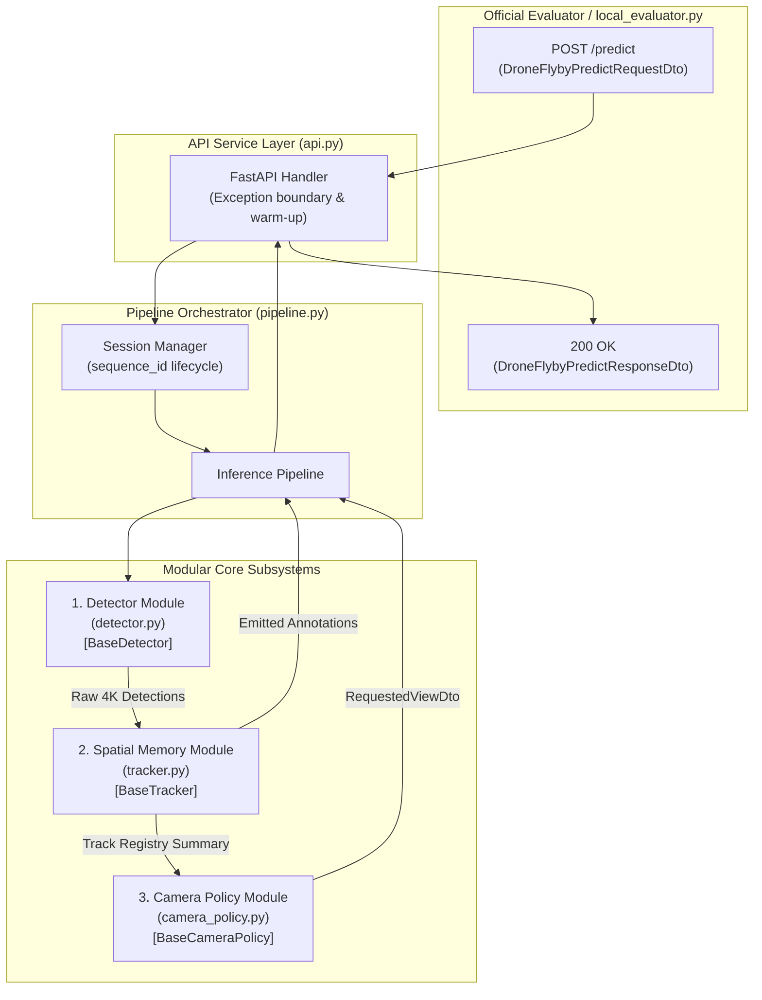
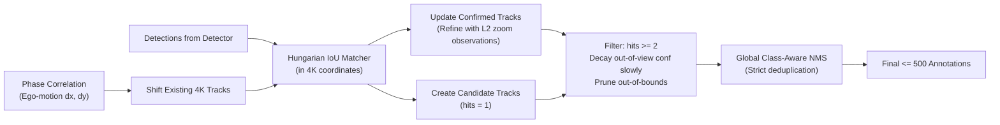
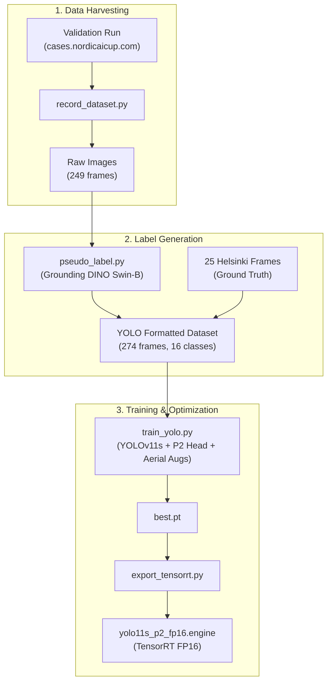

# Drone-Flyby — Modular System Architecture Design

## Executive Summary

This document defines a production-grade, modular system architecture for the **Drone-Flyby** task. It decomposes the solution into independent, swappable components with strict interface contracts, allowing each subsystem (Detection, Spatial Memory, Camera Policy, Offline Training) to be developed, unit-tested, and optimized in isolation without breaking the end-to-end FastAPI endpoint.

---

## 1. High-Level Architectural Overview

The system follows a **Pipelines & Protocols (Clean Architecture)** pattern:



---

## 2. Directory Structure & Component Layout

```
drone-flyby/
├── api.py                    # Entrypoint: FastAPI web service & warm-up hooks
├── config.py                 # Centralized dataclass configuration & hyperparameters
├── dtos.py                   # Official Pydantic wire models (frozen)
├── utils.py                  # Coordinate transformations & image decoders
│
├── core/                     # Modular Online Processing Engine
│   ├── __init__.py
│   ├── pipeline.py           # Pipeline orchestrator & session lifecycle manager
│   ├── interfaces.py         # Abstract base classes (Protocols) for all components
│   ├── detector.py           # Model abstraction (Dummy, YOLOv11, SAHI, TensorRT)
│   ├── tracker.py            # WorldMap, ego-motion estimation, track lifecycle
│   └── camera_policy.py      # Camera steering policies (Sweep, Survey+Zoom, BeliefMap)
│
├── offline/                  # Offline Tooling & Training Pipeline
│   ├── record_dataset.py     # Captures raw frames & metadata from validation runs
│   ├── pseudo_label.py       # Zero-shot pseudo-labeling with Grounding DINO
│   ├── train_yolo.py         # Multi-scale fine-tuning with aerial augmentations
│   └── export_tensorrt.py    # ONNX export and TensorRT FP16 engine builder
│
├── tests/                    # Independent Component Unit Tests
│   ├── test_detector.py      # Tests detector on static Helsinki images
│   ├── test_tracker.py       # Tests tracking & NMS with synthetic/oracle boxes
│   └── test_camera_policy.py # Tests policy decisions & constraint compliance
│
└── research/                 # Task documentation & analysis artifacts
    ├── 01_task_analysis.md
    ├── 02_memory_and_camera_policy.md
    ├── 03_detection_models.md
    └── 04_system_architecture.md
```

---

## 3. Strict Interface Contracts (`core/interfaces.py`)

All modules adhere to Python `Protocol` or `ABC` interfaces, enabling complete decoupling and mock-driven testing.

```python
from abc import ABC, abstractmethod
from dataclasses import dataclass
from typing import List, Optional, Tuple
import numpy as np

from dtos import (
    CameraConstraintsDto,
    DroneFlybyPredictionDto,
    DroneFlybyPredictRequestDto,
    RequestedViewDto,
)


@dataclass(slots=True)
class DetectionResult:
    """Internal normalized detection representation in 4K global coordinates."""
    class_name: str
    bbox_global: Tuple[float, float, float, float]  # [x1, y1, x2, y2] in [0, 1]
    confidence: float
    zoom_level: int
    source_pixel_bbox: Tuple[float, float, float, float]  # in 3840x2160 pixels


@dataclass(slots=True)
class TrackerSummary:
    """Read-only view of current world state passed to the camera policy."""
    num_active_tracks: int
    unscanned_clusters: List[Tuple[int, int]]  # Candidate (cx, cy) target coordinates
    current_shift_estimate: Tuple[float, float]  # (dx, dy) ego-motion per frame


class BaseDetector(ABC):
    """Abstract interface for object detection implementations."""

    @abstractmethod
    def warmup(self) -> None:
        """Run dummy inferences to pre-compile CUDA/TensorRT kernels."""
        pass

    @abstractmethod
    def detect(
        self,
        image_bgr: np.ndarray,
        zoom_level: int,
        source_region_xyxy: Tuple[int, int, int, int],
    ) -> List[DetectionResult]:
        """Detect objects in the 960x540 crop and return global 4K boxes."""
        pass


class BaseTracker(ABC):
    """Abstract interface for spatial memory and tracking."""

    @abstractmethod
    def reset(self, sequence_id: str) -> None:
        """Clear all active tracks and reset ego-motion state for a new sequence."""
        pass

    @abstractmethod
    def update(
        self,
        detections: List[DetectionResult],
        zoom_level: int,
        source_region_xyxy: Tuple[int, int, int, int],
        frame_index: int,
        l0_image_gray: Optional[np.ndarray] = None,
    ) -> List[DroneFlybyPredictionDto]:
        """Update world map, compensate motion, and produce final frame annotations."""
        pass

    @abstractmethod
    def get_summary(self) -> TrackerSummary:
        """Export spatial state summary for camera decision-making."""
        pass


class BaseCameraPolicy(ABC):
    """Abstract interface for camera steering policies."""

    @abstractmethod
    def reset(self, sequence_id: str) -> None:
        """Reset internal exploration maps/heuristics for a new sequence."""
        pass

    @abstractmethod
    def decide_next_view(
        self,
        request: DroneFlybyPredictRequestDto,
        tracker_summary: TrackerSummary,
    ) -> Optional[RequestedViewDto]:
        """Determine next target view adhering to constraints and exploration goals."""
        pass
```

---

## 4. Component Deep Dives & Implementations

### 4.1 Detector Module (`core/detector.py`)

The detector accepts a `960x540` BGR image, performs inference, converts view-local boxes into 4K global boxes via `utils.view_bbox_to_global`, and clips them.

```python
class DetectorFactory:
    """Instantiates detector implementations based on runtime config."""

    @staticmethod
    def create(config) -> BaseDetector:
        if config.DETECTOR_BACKEND == "tensorrt":
            return TensorRTDetector(engine_path=config.TRT_ENGINE_PATH)
        elif config.DETECTOR_BACKEND == "yolo_sahi":
            return SahiYoloDetector(model_path=config.YOLO_WEIGHTS_PATH)
        elif config.DETECTOR_BACKEND == "yolo_standard":
            return StandardYoloDetector(model_path=config.YOLO_WEIGHTS_PATH)
        return DummyCannyDetector()
```

* **Pluggable Architecture**:
  * `DummyCannyDetector`: Fast OpenCV baseline (used for plumbing and unit testing).
  * `StandardYoloDetector`: Runs Ultralytics PyTorch/ONNX directly.
  * `SahiYoloDetector`: Automatically triggers SAHI tiling on Level 0 frames and standard inference on Levels 1 & 2.
  * `TensorRTDetector`: Zero-copy CUDA engine execution via PyCUDA or TensorRT Python bindings.

---

### 4.2 Spatial Memory & Tracker (`core/tracker.py`)

Maintains the persistent **World Map** across the ~250 frames of a flight.



* **Core Responsibilities**:
  1. **Ego-Motion Compensation**: Compares consecutive Level 0 frames using `cv2.phaseCorrelate` (or geometric fallback of 58 px/frame) to shift existing track coordinates forward as the drone moves.
  2. **Scale Agnostic Association**: Matches incoming detections against tracks using **4K source pixel coordinates**. Overwrites bounding boxes and class labels when higher-resolution (Level 2) observations arrive.
  3. **Out-of-View Retention**: When an object moves out of the camera crop, it remains in memory with minimal confidence decay ($0.98^t$). This solves the core competition challenge of reporting full-frame detections from cropped views.
  4. **Strict Local NMS**: Runs class-aware NMS to guarantee no duplicate boxes are sent, protecting precision.

---

### 4.3 Camera Policy Module (`core/camera_policy.py`)

Operates as an independent decision agent.

* **Policies Supported**:
  * `HeuristicSweepPolicy`: Deterministic boustrophedon sweep across the frame (fallback/baseline).
  * `SurveyAndZoomPolicy`: Runs Level 0 survey every 8–10 frames, detects clusters/saliency, then uses Level 1 and Level 2 to inspect targets sequentially, utilizing the **free Level 0 reset** to teleport across quadrants.
  * `BeliefMapPolicy`: Maintains a continuous staleness/uncertainty heatmap, moving towards regions with highest potential unseen information.
* **Safety Filter (Decorator Pattern)**:
  All policy outputs are wrapped by `CameraConstraintGuard`, which validates target coordinates against `request.camera_constraints`, guarantees integer typing, and clamps center deltas to prevent invalid commands.

---

### 4.4 Pipeline Orchestrator & Session Manager (`core/pipeline.py`)

Ties the components together and manages sequence continuity.

```python
class PipelineOrchestrator:
    def __init__(
        self,
        detector: BaseDetector,
        tracker: BaseTracker,
        camera_policy: BaseCameraPolicy,
    ):
        self.detector = detector
        self.tracker = tracker
        self.camera_policy = camera_policy
        self.active_sequence_id: Optional[str] = None
        self.last_frame_index: int = -1

    def handle_request(self, request: DroneFlybyPredictRequestDto) -> DroneFlybyPredictResponseDto:
        # 1. Session boundary check (Validation vs Evaluation vs local test)
        if request.sequence_id != self.active_sequence_id or request.frame_index == 0:
            self._reset_session(request.sequence_id)

        # 2. Account for skipped frames if client was slow
        frame_gap = max(1, request.frame_index - self.last_frame_index)
        self.last_frame_index = request.frame_index

        # 3. Decode incoming view
        image_bgr = decode_view(request.view)

        # 4. Step 1: Detect
        raw_detections = self.detector.detect(
            image_bgr=image_bgr,
            zoom_level=request.view.resolution_level,
            source_region_xyxy=request.view.source_region_xyxy,
        )

        # 5. Step 2: Track & Update Spatial Memory
        l0_gray = cv2.cvtColor(image_bgr, cv2.COLOR_BGR2GRAY) if request.view.resolution_level == 0 else None
        final_annotations = self.tracker.update(
            detections=raw_detections,
            zoom_level=request.view.resolution_level,
            source_region_xyxy=request.view.source_region_xyxy,
            frame_index=request.frame_index,
            l0_image_gray=l0_gray,
        )

        # 6. Step 3: Camera Steering
        tracker_summary = self.tracker.get_summary()
        next_view = self.camera_policy.decide_next_view(
            request=request,
            tracker_summary=tracker_summary,
        )

        # 7. Construct Response
        return DroneFlybyPredictResponseDto(
            request_id=request.request_id,
            frame=request.frame,
            annotations=final_annotations,
            requested_view=next_view,
        )

    def _reset_session(self, new_sequence_id: str):
        self.active_sequence_id = new_sequence_id
        self.tracker.reset(new_sequence_id)
        self.camera_policy.reset(new_sequence_id)
```

---

## 5. Offline Tooling & Training Workflow (`offline/`)



---

## 6. Development & Independent Testing Roadmap

Because interfaces are decoupled, development proceeds across 4 independent tracks:

| Track | Module | Can Develop & Test Without | Verification Command |
|---|---|---|---|
| **Track 1** | `core/tracker.py` | Real detector or camera policy (feed ground truth boxes directly) | `pytest tests/test_tracker.py` |
| **Track 2** | `core/camera_policy.py` | Live detector or API (simulate drone trajectory & constraints) | `pytest tests/test_camera_policy.py` |
| **Track 3** | `core/detector.py` | Live evaluator (run on 25 Helsinki PNG files in `src/`) | `pytest tests/test_detector.py` |
| **Track 4** | `api.py` + `pipeline.py` | Trained weights (plugs in `DummyCannyDetector` for instant verification) | `python local_evaluator.py --realtime` |

---

## 7. Next Implementation Steps

1. **Step 1**: Scaffold `core/interfaces.py`, `config.py`, and `core/pipeline.py`.
2. **Step 2**: Implement `core/tracker.py` with the `WorldMap` and ego-motion compensation.
3. **Step 3**: Implement `core/camera_policy.py` with the Survey+Zoom heuristic policy.
4. **Step 4**: Implement `core/detector.py` supporting baseline Canny and initial YOLOv11 loader.
5. **Step 5**: Connect everything into `api.py` and benchmark with `python local_evaluator.py --realtime`.
