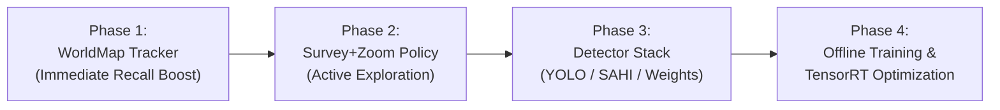

# Implementation Plan: Drone-Flyby Next Phases

## 1. Current Status (What is Already Completed)

The foundation and scaffolding described in [`research/04_system_architecture.md`](file:///home/pablo/Develop/norway-ai-cup/norway-ai-cup/drone-flyby/research/04_system_architecture.md) are fully implemented and verified:

- **Environment**: Conda environment `norway-ai-cup-drone-flyby` (Python 3.11) with all base requirements (`fastapi`, `uvicorn`, `pydantic`, `numpy`, `opencv-python`, `requests`, `faster-coco-eval`, `pytest`).
- **Research Artifacts**: 4 comprehensive documents in [`research/`](file:///home/pablo/Develop/norway-ai-cup/norway-ai-cup/drone-flyby/research/):
    - `01_task_analysis.md` (task rules, optical trade-offs, object sizes)
    - `02_memory_and_camera_policy.md` (coverage math, tracking algorithms, ego-motion)
    - `03_detection_models.md` (YOLOv11, P2 head, SAHI, few-shot strategy, TensorRT)
    - `04_system_architecture.md` (modular design, interface contracts)
- **Scaffolding Code**:
    - [`config.py`](file:///home/pablo/Develop/norway-ai-cup/norway-ai-cup/drone-flyby/config.py): Centralized dataclass configuration.
    - [`core/interfaces.py`](file:///home/pablo/Develop/norway-ai-cup/norway-ai-cup/drone-flyby/core/interfaces.py): Base interfaces (`BaseDetector`, `BaseTracker`, `BaseCameraPolicy`, `DetectionResult`, `TrackerSummary`).
    - [`core/detector.py`](file:///home/pablo/Develop/norway-ai-cup/norway-ai-cup/drone-flyby/core/detector.py): `DummyCannyDetector` producing typed 4K global boxes.
    - [`core/tracker.py`](file:///home/pablo/Develop/norway-ai-cup/norway-ai-cup/drone-flyby/core/tracker.py): `PassthroughTracker` with class-aware NMS and session resets.
    - [`core/camera_policy.py`](file:///home/pablo/Develop/norway-ai-cup/norway-ai-cup/drone-flyby/core/camera_policy.py): `SweepCameraPolicy` and `CameraConstraintGuard` guaranteeing zero rejected commands.
    - [`core/pipeline.py`](file:///home/pablo/Develop/norway-ai-cup/norway-ai-cup/drone-flyby/core/pipeline.py): `PipelineOrchestrator` coordinating stages, tracking latency, and handling exceptions.
    - [`api.py`](file:///home/pablo/Develop/norway-ai-cup/norway-ai-cup/drone-flyby/api.py): Connected to `PipelineOrchestrator` with automated startup warm-up.
    - [`tests/test_scaffolding.py`](file:///home/pablo/Develop/norway-ai-cup/norway-ai-cup/drone-flyby/tests/test_scaffolding.py): Scaffolding unit tests passing (3/3).
    - **End-to-End Local Evaluator**: Verified in both offline and realtime (3 fps) modes (25/25 frames accepted, 0 invalid responses, 0 camera moves refused, 21ms mean round-trip).

---

## 2. Recommended Next Steps (Referencing the Architecture)

Because our components adhere to strict abstract interfaces, we can develop them semi-independently. We recommend executing in the following order:



### Phase 1: Persistent Spatial Memory & WorldMap (`core/tracker.py`)

> [!TIP]
> **Why do this first?** The spatial memory system is model-agnostic and provides the single largest recall boost by continuing to report previously seen objects across the entire 4K frame. We can develop and unit-test it immediately using synthetic/oracle boxes.

#### [MODIFY] [core/tracker.py](file:///home/pablo/Develop/norway-ai-cup/norway-ai-cup/drone-flyby/core/tracker.py)

- Replace `PassthroughTracker` with `WorldMapTracker`:
    1. **Ego-Motion Compensation**: Estimate frame-to-frame pixel shift using `cv2.phaseCorrelate` between consecutive Level 0 frames (with geometric fallback of ~58 px downward shift). Shift all active 4K track coordinates accordingly each frame.
    2. **4K Data Association**: Use Hungarian algorithm (scipy `linear_sum_assignment`) with IoU in 4K coordinate space to associate incoming detections with existing tracks.
    3. **Track Lifecycle**:
        - _Candidate_: 1 hit. Not emitted yet (suppresses false positives).
        - _Confirmed_: $\ge 2$ hits. Emitted in annotations.
        - _Out-of-View Persistence_: If a confirmed track leaves the current camera view, retain it in the WorldMap with minimal confidence decay ($0.98^t$).
        - _Pruning_: Delete tracks that drift outside the 3840×2160 source frame boundaries or fail to accumulate hits while in view.
    4. **Cross-Resolution Refinement**: When a track is re-observed at higher zoom (Level 2), overwrite its bounding box and class ID with the higher-resolution observation.
    5. **Strict Local NMS**: Class-aware NMS to ensure no duplicate boxes are returned.

#### [NEW] [tests/test_tracker.py](file:///home/pablo/Develop/norway-ai-cup/norway-ai-cup/drone-flyby/tests/test_tracker.py)

- Test track creation, ego-motion shifting, out-of-view persistence, and duplicate suppression without needing a real neural network.

---

### Phase 2: Active Camera Steering Policy (`core/camera_policy.py`)

> [!NOTE]
> Moving beyond the simple horizontal sweep allows the camera to actively zoom in on detected object clusters and use the **free Level 0 reset** to teleport across quadrants.

#### [MODIFY] [core/camera_policy.py](file:///home/pablo/Develop/norway-ai-cup/norway-ai-cup/drone-flyby/core/camera_policy.py)

- Implement `SurveyAndZoomPolicy`:
    1. **Periodic L0 Surveys**: Every $N$ frames (e.g. 10 frames), reset to Level 0 (`center_x=1920, center_y=1080`) to capture full-scene overview and update ego-motion estimation.
    2. **Cluster Target Queue**: When at Level 0, identify spatial clusters of detections from `TrackerSummary` that need high-resolution inspection.
    3. **Zoom & Inspect**: Step camera from L0 $\to$ L1 $\to$ L2 centered on target clusters.
    4. **Free Reset Utilization**: When done inspecting a quadrant, trigger the free Level 0 reset to instantly jump to the next cluster rather than slowly panning across the 4K frame at Level 2.
    5. Enforce all transitions through `CameraConstraintGuard`.

#### [NEW] [tests/test_camera_policy.py](file:///home/pablo/Develop/norway-ai-cup/norway-ai-cup/drone-flyby/tests/test_camera_policy.py)

- Simulate full 25-frame trajectories and verify all camera transitions are accepted without any movement violations.

---

### Phase 3: Object Detection Stack (`core/detector.py`)

#### [MODIFY] [core/detector.py](file:///home/pablo/Develop/norway-ai-cup/norway-ai-cup/drone-flyby/core/detector.py)

- Implement `YoloDetector` using `ultralytics`:
    - Support pre-trained weights (COCO or VisDrone aerial checkpoints).
    - Multi-resolution inference:
        - **Level 0**: SAHI sliced inference (4–6 slices) for tiny 4–8 px objects (or high-sensitivity mode).
        - **Levels 1 & 2**: Standard inference at native resolution.
    - Per-zoom confidence thresholds (L0: 0.10, L1: 0.15, L2: 0.20).
- Wire up `warmup()` to pre-compile PyTorch/CUDA execution.

#### [NEW] [tests/test_detector.py](file:///home/pablo/Develop/norway-ai-cup/norway-ai-cup/drone-flyby/tests/test_detector.py)

- Test inference on static Helsinki images (`src/helsinki/images/`) and measure latency.

---

### Phase 4: Offline Training & TensorRT Optimization (`offline/`)

#### [NEW] [offline/record_dataset.py](file:///home/pablo/Develop/norway-ai-cup/norway-ai-cup/drone-flyby/offline/record_dataset.py) (Extend)

- Run against the 249-frame validation sequence on `cases.nordicaicup.com` to harvest raw unlabeled images.

#### [NEW] [offline/pseudo_label.py](file:///home/pablo/Develop/norway-ai-cup/norway-ai-cup/drone-flyby/offline/pseudo_label.py)

- Offline pseudo-labeling using Grounding DINO on the harvested validation frames.

#### [NEW] [offline/train_yolo.py](file:///home/pablo/Develop/norway-ai-cup/norway-ai-cup/drone-flyby/offline/train_yolo.py)

- Fine-tune YOLOv11s with aerial augmentations (mosaic, rotation, copy-paste) on combined dataset (25 Helsinki + 249 pseudo-labeled frames).

#### [NEW] [offline/export_tensorrt.py](file:///home/pablo/Develop/norway-ai-cup/norway-ai-cup/drone-flyby/offline/export_tensorrt.py)

- Export best model to TensorRT FP16 for ~8–15 ms real-time inference.

---

## 3. Verification Plan

### Automated Tests

1. **Unit test suite**:
    ```bash
    conda run -n norway-ai-cup-drone-flyby pytest tests/ -v
    ```
2. **Local Evaluator (Correctness & Benchmarking)**:
    ```bash
    conda run -n norway-ai-cup-drone-flyby python local_evaluator.py
    conda run -n norway-ai-cup-drone-flyby python local_evaluator.py --realtime
    ```
3. **Simulated Latency Headroom Check**:
    ```bash
    conda run -n norway-ai-cup-drone-flyby python local_evaluator.py --realtime --simulate-latency-ms 150
    ```

---

## 4. User Review Required

> [!IMPORTANT]
> **Recommended Immediate Action**:
> We recommend beginning with **Phase 1: Persistent Spatial Memory & WorldMap (`core/tracker.py`)**, as it establishes the core competitive advantage (reporting out-of-view objects across the 4K frame) and can be verified immediately using synthetic tests and local evaluator.
>
> Please let me know if you would like to proceed with **Phase 1 (WorldMap Tracker)** or prefer to jump straight to the **Phase 3 (YOLO Detector)**.
