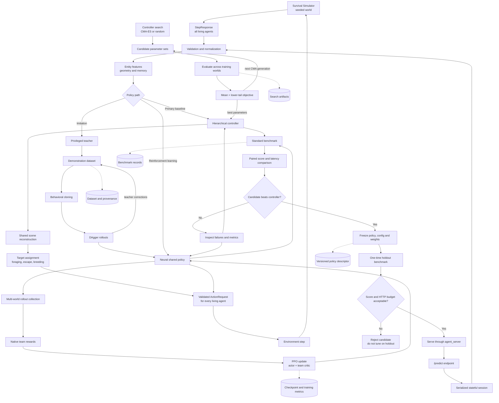

# Policy pipeline overview



## Oversight gates

| Gate | Decision |
| --- | --- |
| Controller search | Does tuning improve both average and lower-tail world performance? |
| Teacher quality | Does the teacher outperform the existing controller consistently? |
| Imitation | Does the learned policy reproduce useful behavior, rather than merely achieve low training loss? |
| PPO | Is native benchmark score improving without excessive action latency? |
| Standard benchmark | Does the candidate beat the hierarchical controller on paired seeds? |
| Freeze | Are configuration, code, weights, checksum, and provenance fixed? |
| Holdout | Does the frozen candidate generalize without further tuning? |
| Deployment | Does the real endpoint remain within individual and cumulative HTTP budgets? |

The principal selection rule is:

```text
Controller search/training metrics
             |
             v
        diagnostic only
             |
             v
Full native-score benchmark + endpoint latency
             |
             v
      deployment decision
```

Low imitation loss, PPO reward, or controller-search score alone should never promote a
policy. The final authority is the unchanged simulator benchmark against the hierarchical
controller.
