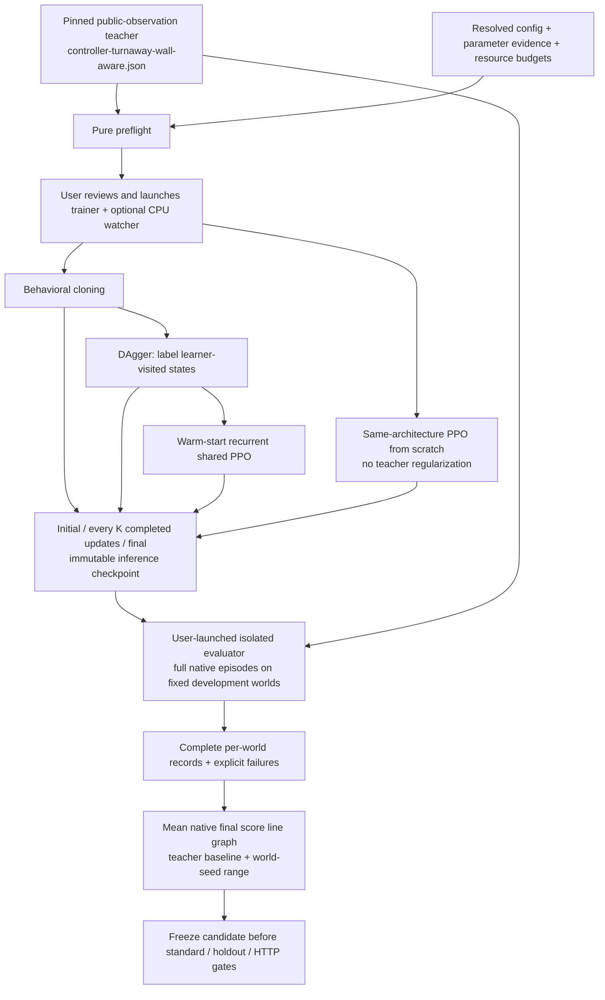

# Teacher-anchored learning pipeline

Every real collection, training, evaluation, or cluster run is **launched by the user**.
The assistant may implement code, run synthetic tests, and regenerate plots from saved
results; it must not launch those experiments. No stage automatically starts another.

## Step-by-step handoff

1. **Teacher:** use `configs\controller-turnaway-wall-aware.json`, not default heuristic
   values or a different escape strategy. Its hash and policy sources are stored.
   The teacher has access only to public observations and their history.
2. **Plan:** `train.py --preflight` validates budgets and parameter evidence and writes
   `run-plan.json`. It does not create a simulator or initialize a GPU.
3. **BC:** the checked-in imitation preset is a deliberately small, provisional
   diagnostic. Inspect teacher labels, component losses, and independent score points.
4. **DAgger:** explicitly enable rounds after that check. Labels are taken on the
   actual mixed-policy trajectory; previous-action features contain executed actions.
5. **PPO:** warm-start a compatible checkpoint, or run the same architecture from
   scratch. The scratch preset has `ppo.imitation_weight=0`; it does not query the
   teacher during collection. Configure warm-start regularization explicitly if desired.
6. **Select:** compare complete development episodes under declared transition/compute
   budgets, freeze, then use holdout. A low loss or a short upward curve is not promotion.

## What the graph means

The initial policy, every five completed collect/fit updates by default, and the final
policy are evaluated. `evaluation.every_updates` controls this reporting preference.
An update is not an optimizer minibatch. Evaluation can lag behind training; both latest
published and latest evaluated updates are shown.

`progress\learning-curve.png` shows mean **full-episode native final score**, not partial
rollout reward or loss. The shaded band is the observed world-seed range after averaging
repeats within each world, **not** a confidence interval. The teacher baseline uses the
same cases. The tick-based graph charges recorded warm-start collection as well.
Failed/incomplete evaluations create gaps, never zeros or partial means.

CSV/JSONL and immutable episode records allow graphs to be regenerated without running
a policy. Reused development worlds and optimizer-seed uncertainty are different issues.
The three-world quick curve is exploratory; holdout is not a monitoring suite.

## Failure and restart behavior

- Trainer checkpoints remain separate from slim immutable evaluation snapshots.
- A full queue pauses training at a completed-update boundary (exit code 3); it does
  not silently discard snapshots. User-run evaluation drains the queue before resume.
- Resumed runs preserve historical curve points and global update numbers. Worlds
  restart; exact live-engine continuation is not promised.
- Failed episodes do not auto-retry. Explicit retry is allowed only inside the
  pre-reviewed `evaluation.max_attempts` and total evaluation budget.
- Trainer and evaluator verify frozen sources/protocols. Do not synchronize new code
  into a live run; restart under a newly reviewed plan instead.
- The first baseline uses `action_repeat=1` everywhere. Existing macro-action
  experiments are not deployment-equivalent and cannot use this pipeline unnoticed.

## Decision evidence, not magic numbers

`configs\evidence-diagnostic.json` explains the provisional presets and their units,
alternatives, and uncertainty. Preflight expands every group to the exact resolved values.
An extended plan requires exact values and hashed measurement artifacts for every group,
including a completed pilot manifest with matching mode/model/teacher/device and a completed
final development evaluation. An unrelated file or an unfinished pilot does not qualify.
The tool checks evidence integrity, not whether a scientific claim is true; the user must
review relevance to the teacher, platform, and workload.

Native undiscounted score justifies `gamma=1`; synthetic return tests validate its
implementation. Learning rate, trace length, recurrence width, clipping, and batch sizes
still require measured sensitivity experiments. No mathematical proof of optimality is
claimed. A100/H100 memory availability removes the laptop cap, not the need to measure.
